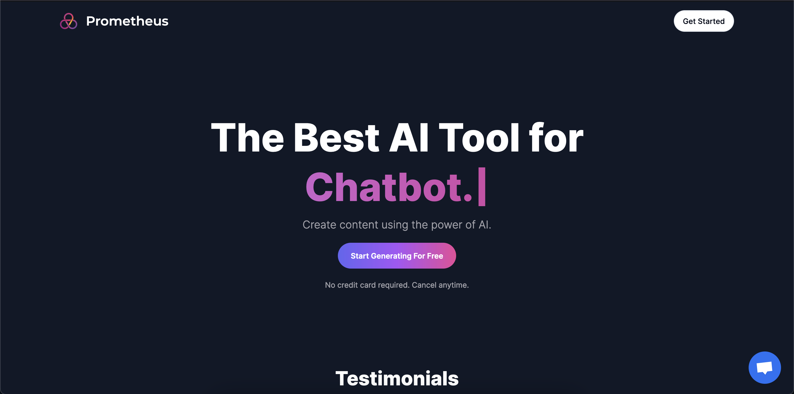
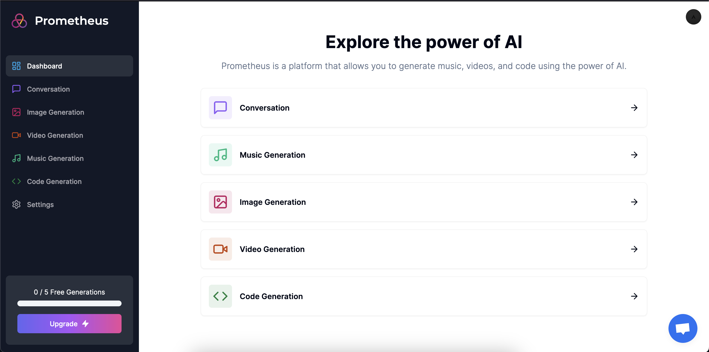
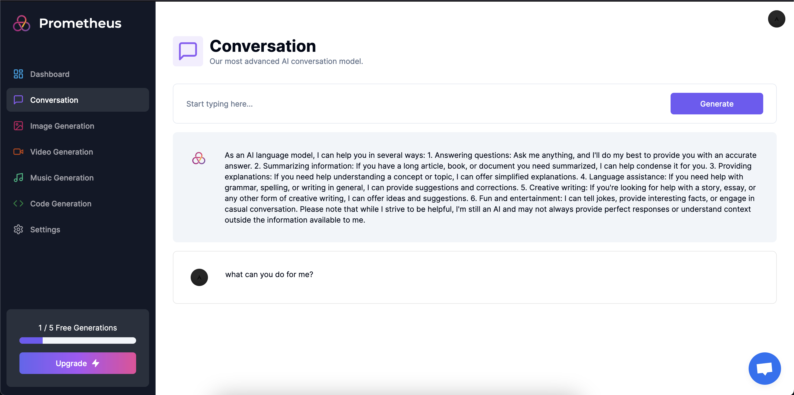
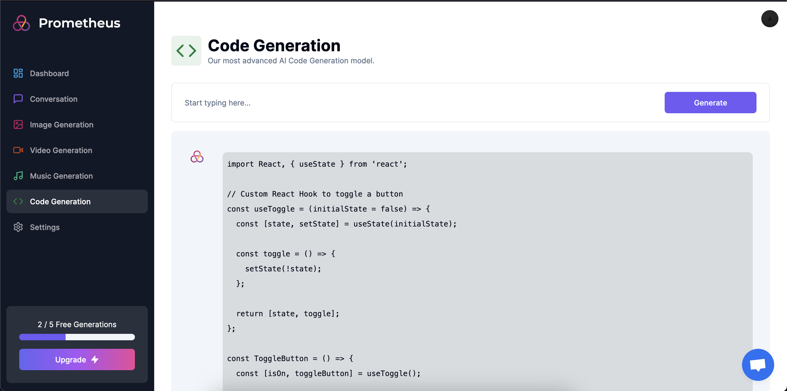
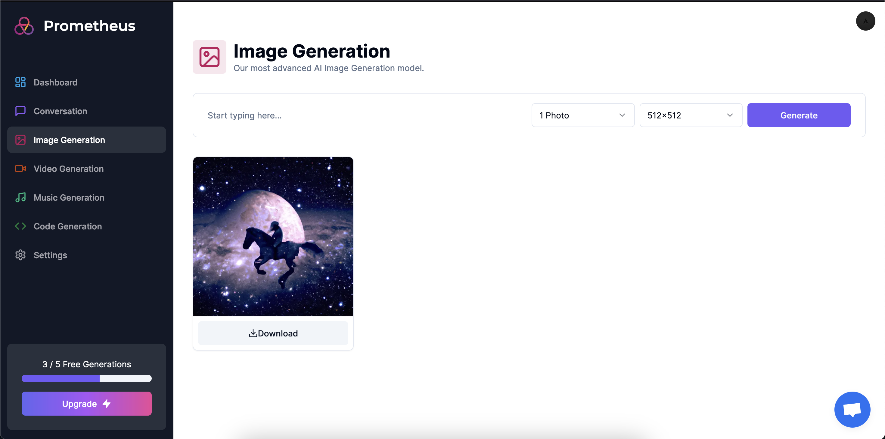
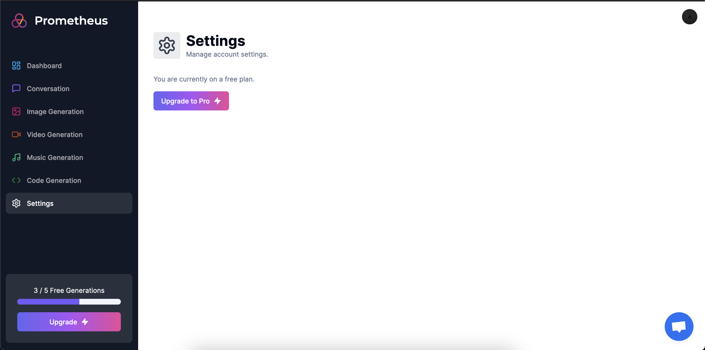
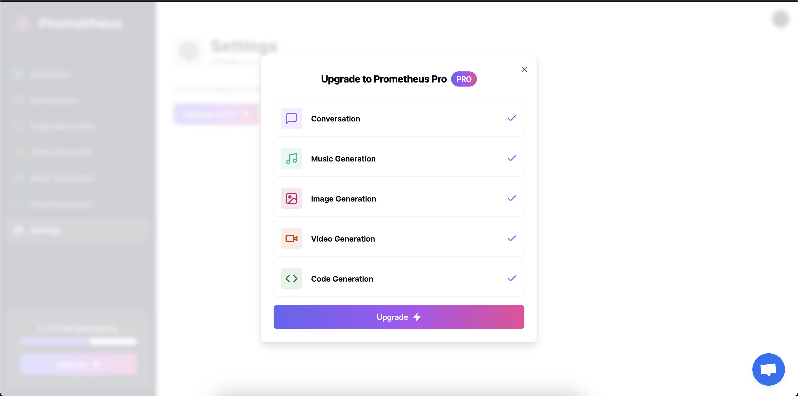

# AI-SaaS - AI-Powered Software-as-a-Service Application

[](https://nextjs.org/)
[](https://openai.com/)
[](https://replicate.ai/)
[](https://tailwindcss.com/)
[](https://prisma.io/)
[](https://stripe.com/)

AI-SaaS is an advanced and adaptable Software-as-a-Service (SaaS) application that harnesses the capabilities of cutting-edge technologies, including Next.js, OpenAI, Replicate, Tailwind CSS, Prisma, and Stripe. The primary goal of this application is to empower users by offering AI-powered services that facilitate easy access and utilization of artificial intelligence in their projects and workflows.

## Features

- **AI Services**: AI-SaaS provides an extensive array of AI services, including conversation, code generation, image generation, music generation, and video generation. These services are accessible through an intuitive and user-friendly interface.

- **Next.js**: AI-SaaS is built on the Next.js framework, offering server-side rendering, routing, and other essential features out of the box. This ensures superior performance and search engine optimization (SEO) for the application.

- **OpenAI Integration**: The application seamlessly integrates with OpenAI's powerful AI models and APIs, enabling users to leverage state-of-the-art AI capabilities. From generating human-like text to answering questions, AI-SaaS harnesses the full potential of OpenAI.

- **Replicate**: AI-SaaS employs Replicate to enhance model reproducibility and facilitate seamless experimentation with various AI models. This ensures the AI models used in the application are robust and reliable.

- **Tailwind CSS**: The UI of AI-SaaS is meticulously styled using Tailwind CSS, a utility-first CSS framework. This enables easy customization and consistent design throughout the application.

- **Prisma**: The application utilizes Prisma as its ORM (Object-Relational Mapping) tool, simplifying database access and management. This enhances the efficiency of handling user data and preferences.

- **Stripe Integration**: AI-SaaS seamlessly incorporates Stripe for secure and efficient payment processing. Users can subscribe to premium plans and access additional AI services based on their subscription level.

## Screenshots








## Getting Started

# AI SaaS Platform

An AI-powered SaaS application built with Next.js, Prisma, Stripe, Clerk, OpenAI, and Replicate.

This platform provides multiple AI utilities including:

- AI Chat
- Code Generation
- Image Generation
- Music Generation
- Video Generation
- Subscription Billing
- User Authentication
- API Usage Tracking

---

# Tech Stack

| Technology | Purpose |
|---|---|
| Next.js 13 | Frontend + Backend |
| TypeScript | Type Safety |
| Tailwind CSS | UI Styling |
| Prisma | ORM |
| MySQL / PlanetScale | Database |
| Clerk | Authentication |
| Stripe | Payments & Subscription |
| OpenAI API | AI Text Generation |
| Replicate API | Media Generation |

---

# Features

## Authentication
- Secure authentication using Clerk
- Protected dashboard routes
- User session management

## AI Tools
- Conversational AI
- AI code generation
- AI image generation
- AI music generation
- AI video generation

## Subscription System
- Free and Pro plans
- Stripe checkout integration
- Usage limitation for free users

## Modern UI
- Responsive dashboard
- Dark mode support
- Optimized layouts using Tailwind CSS

---

# Project Structure

```bash
app/
components/
lib/
prisma/
public/
screenshots/
```

---

# Architecture Flow

```text
User
  ↓
Next.js Frontend
  ↓
API Routes
  ↓
Authentication (Clerk)
  ↓
AI Services (OpenAI / Replicate)
  ↓
Database (Prisma + MySQL)
  ↓
Stripe Billing System
```

---

# Environment Variables

Create a `.env` file in the project root.

```env
DATABASE_URL=

NEXT_PUBLIC_APP_URL=

NEXT_PUBLIC_CLERK_PUBLISHABLE_KEY=
CLERK_SECRET_KEY=

OPENAI_API_KEY=

REPLICATE_API_TOKEN=

STRIPE_SECRET_KEY=
STRIPE_WEBHOOK_SECRET=

CRISP_WEBSITE_ID=
```

---

# Local Development

## Install dependencies

```bash
npm install
```

## Run Prisma

```bash
npx prisma generate
npx prisma db push
```

## Start development server

```bash
npm run dev
```

Open:

```text
http://localhost:3000
```

---

# Deployment

Recommended deployment platform:

- Vercel

Recommended database:

- PlanetScale
- Railway

Before deployment:
- Configure production environment variables
- Add Stripe webhook URL
- Configure Clerk production domain


# Security Notes

- Never commit `.env` files
- API keys must remain private
- Stripe webhook secrets should only exist in server environments
- Database credentials should never be exposed publicly

---

## License

Based on an open-source project licensed under MIT.
Modified and customized for learning and development purposes.